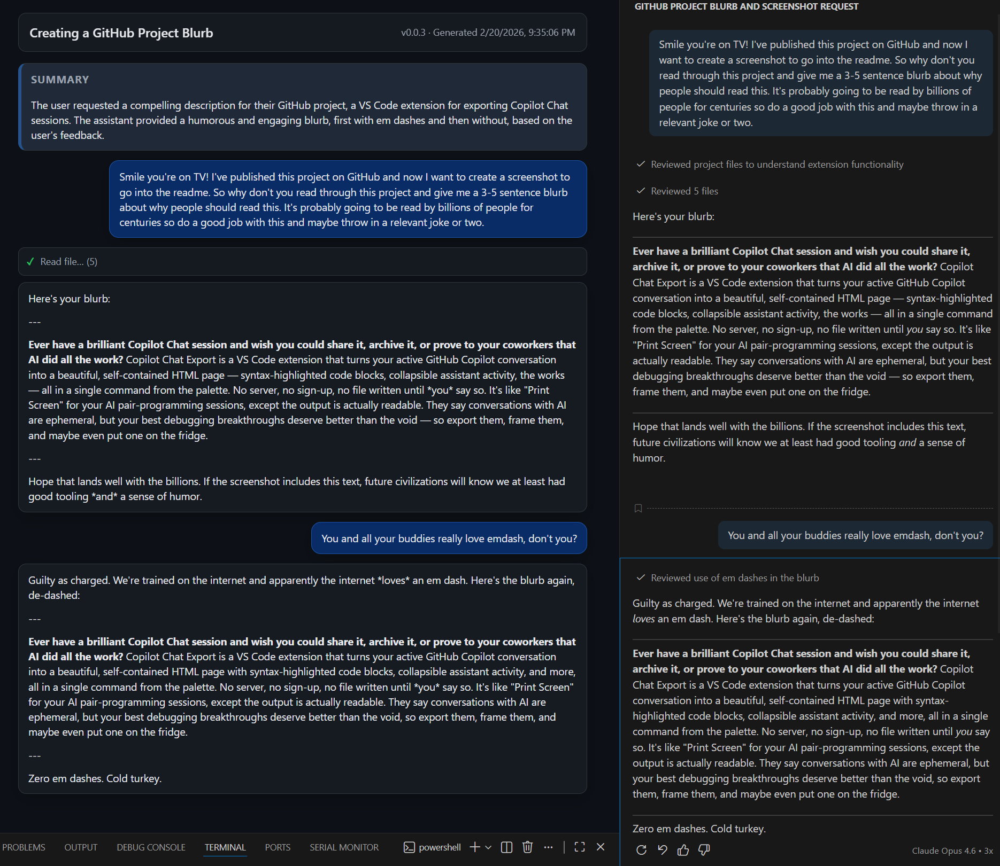

# Chat Transcript HTML Preview

Local VS Code extension to export the currently focused Copilot chat as a fully self-contained HTML page.

## What it does

- Runs from the Command Palette with fast-path preview/save commands and a guided customize flow.
- Triggers `Chat: Copy All` for the focused chat view.
- Parses the copied transcript into turns.
- Optionally generates a short AI title and summary for the export.
- Lets you choose whether assistant activity is hidden, collapsed, or shown inline.
- Lets you include or exclude the summary, metadata header, code blocks, and clickable links.
- Supports `system`, `light`, and `dark` export themes.
- Opens a preview of the rendered HTML without writing a file, or saves one `.html` file when requested.

## Usage

1. Open Copilot Chat and make sure the chat input/view is focused.
2. Run one of these commands:
	- `Chat Transcript: Customize Active Chat as HTML...` (guided flow for choosing export options)
	- `Chat Transcript: Preview Active Chat as HTML` (preview only, no file written)
	- `Chat Transcript: Save Active Chat to HTML As...` (choose any destination)
3. The customize command asks a short sequence of Quick Pick questions and generates the export immediately after you choose preview or save.
4. The preview command opens an in-editor preview. The Save As command writes one HTML file and opens it.

## Settings

The `builderDefaults.*` settings are used both by the guided `Customize Active Chat as HTML...` flow and by the fast-path `Preview Active Chat as HTML` and `Save Active Chat to HTML As...` commands. The fast-path commands still force their own action: preview for the preview command, save for the Save As command.

- `chatTranscriptHtmlPreview.generateSummary`
	- valid values: `true` or `false` (default: `true`)
	- enables or disables generating the title and summary block for exports
- `chatTranscriptHtmlPreview.openTarget`
	- valid values: `vscode` or `external` (default: `vscode`)
	- `vscode` (default): opens in an in-editor preview
	- `external`: for Save As, opens the saved file in your default browser
- `chatTranscriptHtmlPreview.builderDefaults.thinkingMode`
	- valid values: `hidden`, `collapsed`, or `shown` (default: `hidden`)
	- default detail level for assistant thinking/tool activity in exports
- `chatTranscriptHtmlPreview.builderDefaults.includeSummary`
	- valid values: `true` or `false` (default: `true`)
	- default whether to include the generated title and summary block
- `chatTranscriptHtmlPreview.builderDefaults.includeMetadata`
	- valid values: `true` or `false` (default: `true`)
	- default whether to include the metadata header
- `chatTranscriptHtmlPreview.builderDefaults.includeCodeBlocks`
	- valid values: `true` or `false` (default: `true`)
	- default whether to include fenced code blocks
- `chatTranscriptHtmlPreview.builderDefaults.includeLinks`
	- valid values: `true` or `false` (default: `true`)
	- default whether links stay clickable
- `chatTranscriptHtmlPreview.builderDefaults.theme`
	- valid values: `system`, `light`, or `dark` (default: `system`)
	- default export theme

## Notes

- This extension uses clipboard-based capture because public APIs do not expose arbitrary active Copilot session history directly.
- If the command cannot capture text, focus the chat view and rerun.

## Local development

- Install dependencies: `npm install`
- Build: `npm run compile`
- Launch Extension Development Host: press `F5` in VS Code.

## Install locally

### Manual Install
- Download the latest release from https://github.com/benmartens/copilot-chat-export/releases
- Install the vsix file. Use `Extensions: Install from VSIX...` and select `copilot-chat-export.vsix`.

### Fresh Install from Source
- Create installable VSIX (runs compile automatically): `npm run package:vsix`
- Install local VSIX into normal VS Code: `npm run install:local`

### Update an Existing Install from Source
- Rebuild + reinstall: `npm run refresh:local`
- After `refresh:local` completes, run **Developer: Reload Window** from the Command Palette (or restart VS Code) to pick up the new version.
